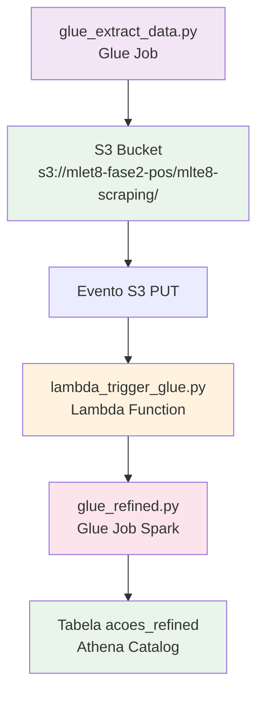
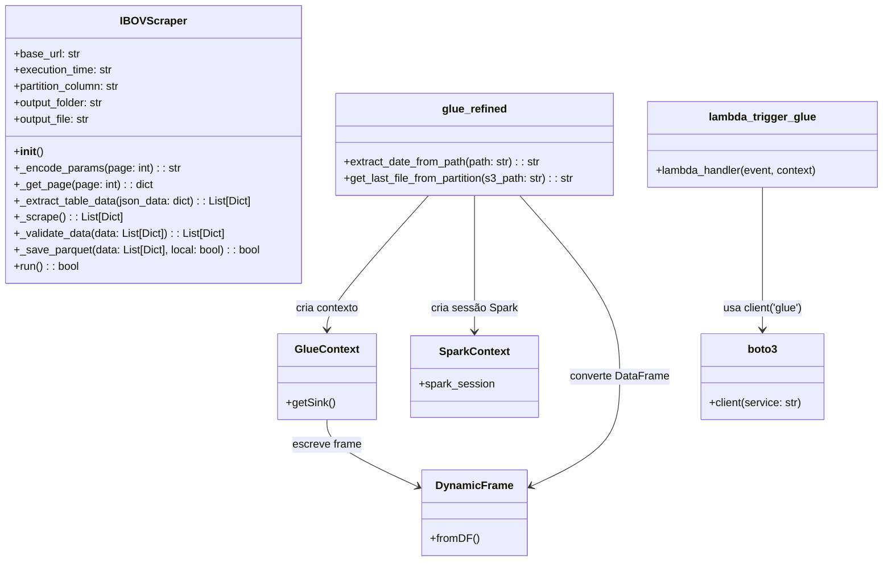

# Documentação Técnica - Tech Challenge II FASE

## Visão Geral

Este projeto implementa um pipeline de ETL (Extract, Transform, Load) para coleta e processamento de dados do portfólio diário do IBOV (Índice Bovespa) da B3. O pipeline utiliza serviços AWS como Glue, Lambda e S3 para automatizar a coleta, transformação e armazenamento de dados.

## Arquitetura do Pipeline

O fluxo de dados segue a seguinte sequência:

1. **Glue Job de Extração** (`glue_extract_data.py`)
2. **Armazenamento no S3**
3. **Trigger Lambda** (`lambda_trigger_glue.py`)
4. **Glue Job de Refinamento** (`glue_refined.py`)
5. **Armazenamento Final na Tabela** (`acoes_refined`)

### Diagrama de Fluxo

## Diagrama de Classes UML

O diagrama abaixo representa as classes principais e suas interações no fluxo de dados do pipeline ETL.

### Explicação do Fluxo de Dados no Diagrama

1. **`IBOVScraper`** (em `glue_extract_data.py`): Classe responsável pela extração de dados da API B3, validação e salvamento no S3.

3. **`lambda_trigger_glue`** → **`boto3`**: A função Lambda utiliza o cliente boto3 para iniciar o job Glue de refinamento quando um arquivo é salvo no S3.

4. **`glue_refined`** → **`GlueContext`** e **`SparkContext`**: O job de refinamento utiliza o contexto Glue e Spark para processar os dados.

5. **`glue_refined`** → **`DynamicFrame`**: Converte o DataFrame Spark em DynamicFrame para escrita no catálogo Glue/Athena.

## Componentes Detalhados

### 1. Glue Job de Extração: `app/services/glue_extract_data.py`

**Propósito:** Job Glue que executa o scraping do IBOV e salva os dados brutos no S3.

**Principais Métodos:**

- `__init__()`: Inicializa parâmetros como URL base, data de execução e caminhos de saída
- `_encode_params(page)`: Codifica parâmetros da requisição em base64
- `_get_page(page)`: Faz requisição HTTP para uma página específica
- `_extract_table_data(json_data)`: Extrai dados da resposta JSON
- `_scrape()`: Coordena a coleta de todas as páginas
- `_validate_data(data)`: Remove duplicatas baseadas no código do ativo
- `_save_parquet(data, local=False)`: Salva dados em formato Parquet no S3

**Fonte de Dados:** `https://sistemaswebb3-listados.b3.com.br/indexProxy/indexCall/GetPortfolioDay/`

**Estrutura dos Dados Coletados:**
- `codigo`: Código do ativo (string)
- `acao`: Nome da empresa (string)
- `tipo`: Tipo da ação (string)
- `qtde_teorica`: Quantidade teórica (inteiro)
- `part_pct`: Participação percentual (float)
- `anomesdia`: Data de execução (YYYY-MM-DD)

**Armazenamento:**
- Salva dados diretamente no S3 em formato Parquet
- Particiona dados por `anomesdia`
- Destino: `s3://mlet8-fase2-pos/mlte8-scraping/`

**Configuração Terraform:**
- Job Name: Definido em `terraform.tfvars`
- Schedule: Cron diário (ex: `cron(0 3 * * ? *)` - 3:00 AM diariamente)
- Tipo: Python Shell

### 2. Lambda Trigger: `app/services/lambda_trigger_glue.py`

**Propósito:** Função Lambda acionada por eventos do S3 para iniciar o job de refinamento.

**Trigger:** Evento PUT no bucket `s3://mlet8-fase2-pos/mlte8-scraping/`

**Funcionalidades:**
- Extrai informações do arquivo do evento S3 (bucket, key)
- Inicia o Glue Job `glue_refined_spark`
- Passa o caminho do arquivo como parâmetro `--input_file`

**Parâmetros Passados:**
- `--input_file`: Caminho completo do arquivo Parquet que acionou o evento

### 3. Glue Job de Refinamento: `app/services/glue_refined.py`

**Propósito:** Processa os dados brutos, compara com a partição anterior e gera dados refinados.

**Tecnologia:** Apache Spark (PySpark)

**Principais Funcionalidades:**

- **Comparação Temporal:** Carrega dados da partição anterior (dia anterior)
- **Cálculo de Diferenças:** Calcula `diff_part_pct` (diferença na participação percentual)
- **Categorização:** Adiciona coluna `nivel_participacao` baseada em faixas de participação
- **Transformações:**
  - Renomeia colunas: `codigo` → `ticker`, `qtde_teorica` → `n_acoes_teoricas`
  - Adiciona coluna `anomesdia` com data apropriada

**Lógica de Categorização:**
- `pequena`: part_pct ≤ 0.1
- `media`: 0.1 < part_pct ≤ 1
- `grande`: part_pct > 1

**Saída:**
- **Local:** `s3://mlet8-fase2-pos/output_glue/refined/`
- **Tabela Athena:** `acoes_refined`
- **Particionamento:** `anomesdia`, `ticker`
- **Formato:** Parquet

## Infraestrutura AWS (Terraform)

### Recursos Criados

**IAM Role:**
- Nome: `{job_name}-role`
- Política: `AWSGlueServiceRole`

**Glue Job:**
- Nome: Definido em variáveis
- Tipo: `glueetl`
- Python Version: 3
- Capacidade Máxima: 2 DPU
- Script Location: S3 path definido em variáveis

**Glue Trigger:**
- Tipo: SCHEDULED
- Schedule: Cron definido em variáveis

### Variáveis Terraform

- `aws_access_key`: Chave de acesso AWS
- `aws_secret_key`: Chave secreta AWS
- `aws_session_token`: Token de sessão (se aplicável)
- `job_name`: Nome do job Glue
- `script_path`: Caminho S3 do script Python
- `output_path`: Caminho S3 de saída
- `schedule_cron`: Expressão cron para agendamento

## Buckets S3 Utilizados

1. **mlte8-scraping** (`s3://mlet8-fase2-pos/mlte8-scraping/`): Dados brutos em Parquet
2. **output_glue/refined** (`s3://mlet8-fase2-pos/output_glue/refined/`): Dados refinados
3. **athena-mlet8** (`s3://mlet8-fase2-pos/athena-mlet8/`): Localização do catálogo Athena

## Dependências Python

**requirements.txt:**
- pandas
- requests
- boto3
- pyarrow
- pyspark (para jobs Glue)

## Utilitários

### `app/utils/data_cleaners.py`
Funções de limpeza de dados:
- `clean_number()`: Remove pontos e espaços, converte para int
- `clean_percentage()`: Remove %, converte vírgula para ponto, converte para float
- `clean_text()`: Remove espaços extras

### `app/utils/constants.py`
Constantes do projeto:
- `S3_PATH`: Caminho base para S3 (atualmente vazio no código local)

## Fluxo de Execução Típico

1. **Agendamento Diário:** Glue Trigger executa `glue_extract_data.py` às 3:00 AM
2. **Coleta de Dados:** Job extrai dados da API B3 e salva no S3
3. **Trigger Automático:** Evento S3 aciona Lambda function
4. **Refinamento:** Lambda inicia `glue_refined_spark` com caminho do arquivo
5. **Processamento:** Job Spark compara dados atuais com anteriores
6. **Armazenamento Final:** Dados refinados salvos na tabela `acoes_refined`

## Monitoramento e Logs

- **CloudWatch Logs:** Todos os jobs Glue e Lambda functions geram logs
- **Métricas Glue:** Habilitadas nos argumentos padrão (`--enable-metrics`)
- **Status Jobs:** Acompanhados via AWS Glue Console

## Segurança

- **IAM Roles:** Roles específicas para Glue e Lambda com permissões mínimas
- **Políticas:** Anexadas apenas as políticas necessárias (AWSGlueServiceRole)
- **Acesso S3:** Controlado via IAM roles dos serviços

## Próximos Passos e Melhorias

1. Implementar alertas e notificações de falha
2. Adicionar validações de qualidade de dados
3. Implementar retry automático em caso de falhas
4. Otimizar performance dos jobs Spark
5. Adicionar testes automatizados
6. Documentar procedures de recovery e backup</content>
<parameter name="filePath">/Users/vagnerantononiodasilva/Documents/projetos/mle_tech_chalenge_2/technical_documentation.md